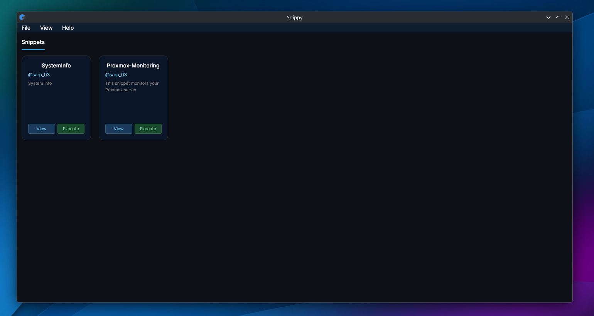
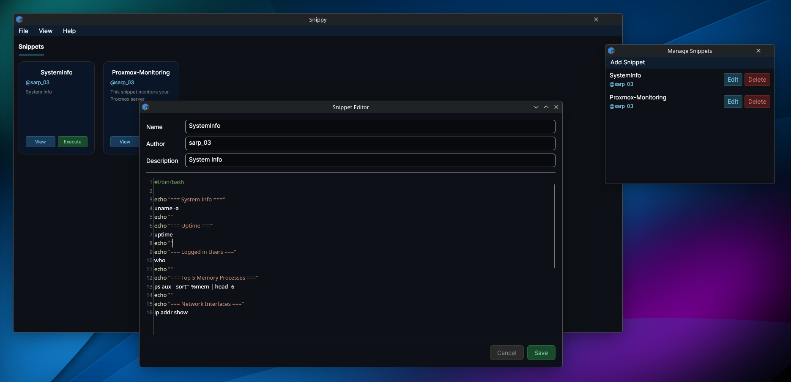
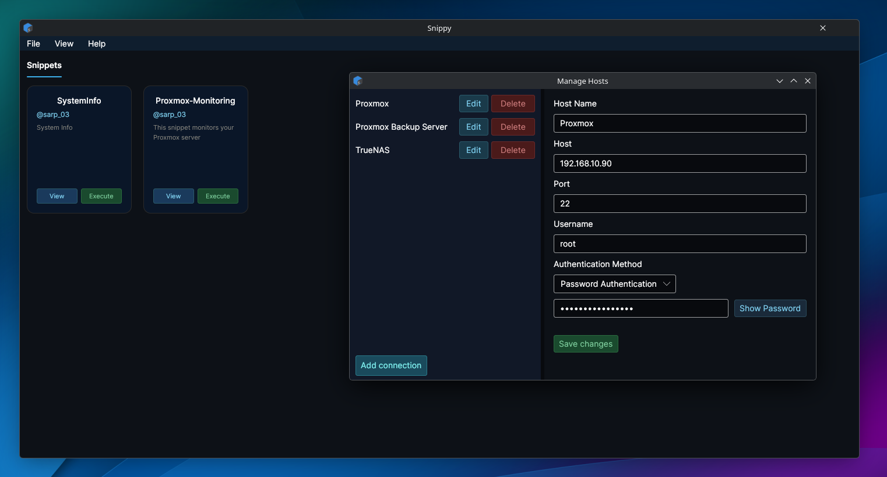
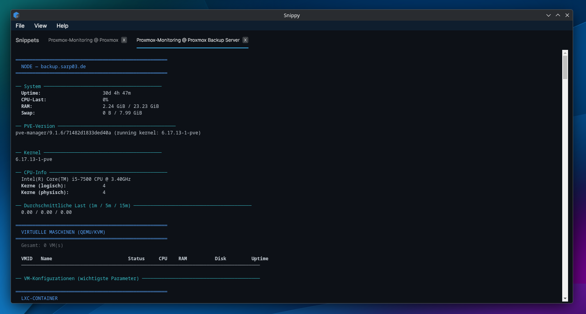
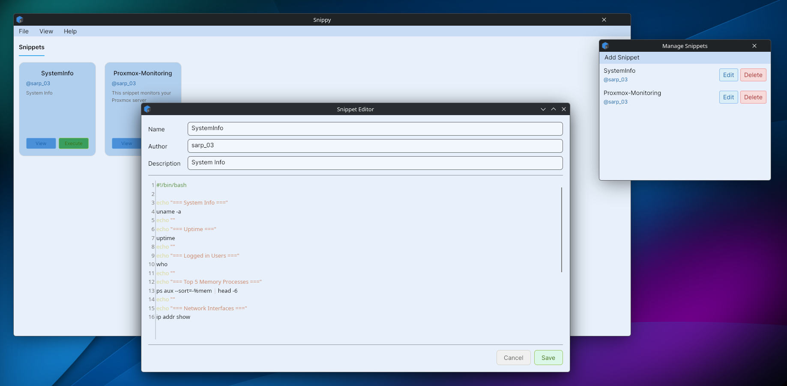
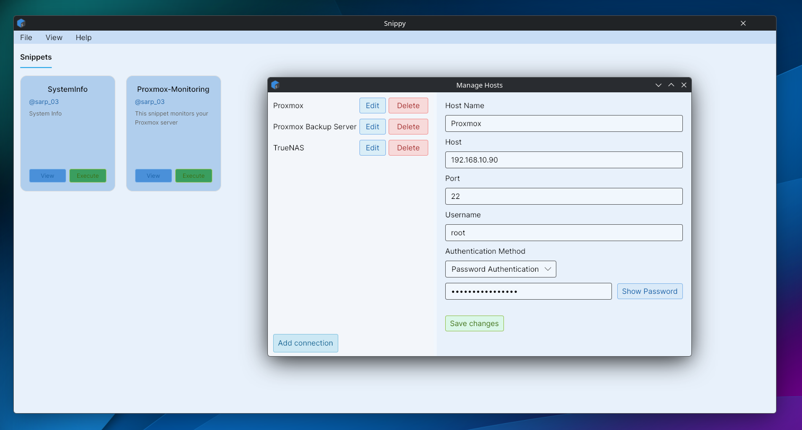
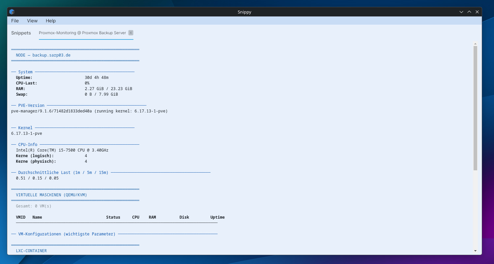

# Snippy

> A desktop application for managing and executing shell script snippets on remote SSH servers.

Snippy lets you organize your shell scripts as reusable snippets and run them on one or multiple SSH servers simultaneously — with live output streamed directly into the app.

---

## Features

- **Snippet Management** — Create, edit, and organize your shell scripts with a built-in shell editor
- **SSH Host Management** — Manage multiple SSH connections with password or private key authentication
- **Parallel Execution** — Run a snippet on multiple servers at the same time, each with its own live output tab
- **Live Output Streaming** — Watch your script execute in real time via an integrated terminal view
- **Preferences** — Customize terminal font size and application theme (dark/light)
- **Snippet Hub** *(coming soon)* — Browse and import community snippets directly from within the app

---
## Screenshots
### Dark Mode
<div align="center">
  
  
  
  
</div>

### Light Mode
<div align="center">
  
  
  
</div>

---

## Installation

No release yet. To run from source:

```bash
git clone -b dev https://github.com/001Sarper/Snippy.git
cd Snippy
dotnet run
```

**Requirements:**
- .NET 10
- Linux / Windows / macOS

---

## Built With

- [Avalonia UI](https://avaloniaui.net/) — Cross-platform UI framework for .NET
- [SSH.NET](https://github.com/sshnet/SSH.NET) — SSH connectivity and command execution
- [xterm.js](https://xtermjs.org/) — Terminal emulator for live output rendering

---

## Roadmap

- [x] Snippet management with shell editor
- [x] SSH connection management
- [x] Parallel execution on multiple servers
- [x] Live output streaming per server tab
- [x] Preferences window
- [ ] Snippet Hub — community snippet sharing via URL
- [ ] First stable release

---

## License

Snippy is licensed under the [GNU General Public License v3.0](LICENSE).

---

## Author

Made by [@sarp_03](https://github.com/001Sarper)